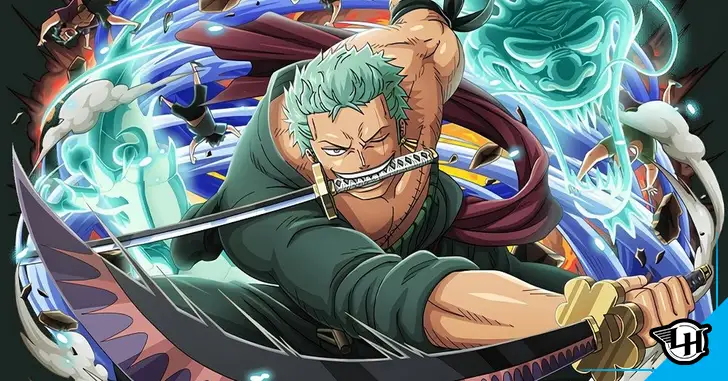

# Gerando_imagem_com_IA

Chegou a hora de você construir um portfólio ainda mais rico e impressionar futuros recrutadores. Para isso, é sempre importante mostrar os resultados do seu esforço e como você os obteve, deixando claro o seu racional. Siga os passos abaixo para criar um portfólio impressionante:

1. Crie um novo repositório no GitHub com um nome de sua preferência.
2. Crie uma pasta chamada 'inputs' e salve as imagens que você utilizou.
3. Crie uma pasta chamada 'output' e salve os resultados de reconhecimento de texto nessas imagens.
4. Crie um arquivo chamado `readme.md` e descreva o processo, incluindo alguns prints, insights e possibilidades que você aprendeu durante o conteúdo.
5. Compartilhe conosco o link desse repositório através do botão 'entregar projeto'.

Aproveite essa oportunidade para mostrar suas habilidades e conhecimentos em processamento de imagens com IA. Boa sorte!

## Processo

Durante o desenvolvimento deste projeto, utilizei a biblioteca de reconhecimento de texto da Microsoft para gerar imagens com IA. Aqui está uma visão geral do processo que segui:

1. Primeiro, criei um novo repositório no GitHub com o nome "Gerando_imagem_com_IA".
2. Em seguida, criei uma pasta chamada 'inputs' e salvei as imagens que utilizei para o reconhecimento de texto.
3. Depois, criei uma pasta chamada 'output' e salvei os resultados do reconhecimento de texto nessas imagens.
4. Para realizar o reconhecimento de texto, utilizei a biblioteca de reconhecimento de texto da Microsoft, que possui recursos avançados de IA.
5. No arquivo `readme.md`, descrevi todo o processo, incluindo alguns prints das imagens utilizadas e dos resultados obtidos.
6. Durante o desenvolvimento deste projeto, aprendi diversas possibilidades e insights sobre processamento de imagens com IA, o que me permitiu criar um portfólio ainda mais rico e impressionante.

## Resultados

Como sou muito fã da serie de anime OnePiece, resolvi pegar uma imagem de um dos meus personagem favorito e criar ele na era da IA com um pouco de inteligencia artificial ao redor dele.

.jpg)

## Insights e Possibilidades

Durante o desenvolvimento deste projeto, obtive alguns insights interessantes e identifiquei diversas possibilidades para explorar no futuro. Alguns deles incluem:

- A possibilidade de utilizar técnicas avançadas de processamento de imagens para melhorar a qualidade dos resultados de reconhecimento de texto.
- Explorar outras bibliotecas e ferramentas de IA para realizar tarefas mais complexas de processamento de imagens.
- Integrar o reconhecimento de texto em um aplicativo ou serviço para automatizar tarefas do dia a dia.

Compartilho aqui o link do meu repositório no GitHub: [Gerando_imagem_com_IA](https://github.com/wastenio/Gerando_imagem_com_IA.git)

Espero que este projeto demonstre minhas habilidades e conhecimentos em processamento de imagens com IA. Estou animado para receber seu feedback e discutir possíveis oportunidades futuras. Obrigado pela oportunidade!
